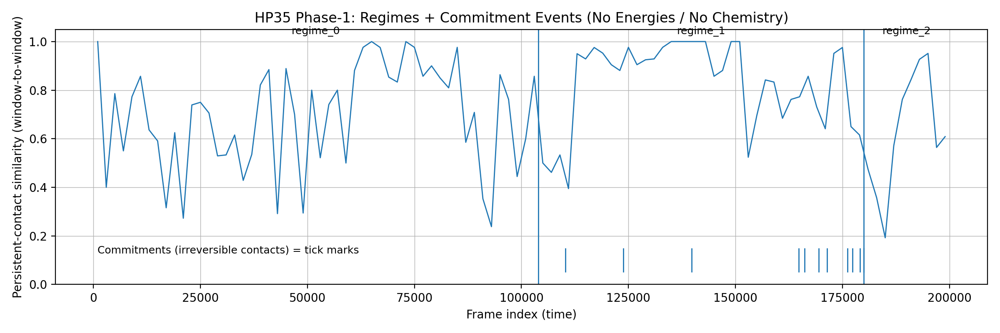

## HP35 Phase-1 (Invariant Engine Domain #2)

---

## Villin Headpiece — Regime & Commitment Demonstration

This directory contains a Phase-1 reference analysis on Villin Headpiece (HP35) molecular dynamics trajectories.

It provides a public, inspectable artifact demonstrating how regime structure and persistent constraints can be exposed from raw contact geometry — without energies, chemistry, or learned models.

This repository is designed for demonstration and inspection, not to represent the full invariant engine.

---

  

---

## Purpose

The purpose of this repository is to provide:

A reproducible reference figure

Explicit regime segmentation

Inspectable commitment events

A transparent analysis lens that exposes invariant structure in time-series data

It exists to support evaluation, testing, and conceptual demonstration — not to provide a complete analysis or discovery pipeline.

---

## What This Analysis Does

This repository includes scripts that:

Extract contact graphs from HP35 distance data

Aggregate contacts into windowed persistence motifs

Segment the trajectory into coarse structural regimes

Identify high-persistence contact commitments

Produce a single Phase-1 figure visualizing these signals

All outputs are directly inspectable and derived from simple, documented operations.

---

## What This Analysis Is Not

This repository does not:

Perform energy calculations

Use chemical force fields

Predict native structure

Train or apply machine learning models

Discover invariants automatically

Represent the full invariant engine

Those capabilities exist only in the private invariant engine and are intentionally excluded from this repository.

---

## Outputs

The primary output is a single Phase-1 figure:

You can regenerate the Phase-1 figure using the included outputs:

python3 src/hp35/make_phase1_figure.py \
  --telemetry outputs/runs/hp35_first200k_win_clean_window_telemetry.jsonl \
  --regimes outputs/runs/hp35_first200k_win_clean_regimes.json \
  --commitments outputs/runs/hp35_first200k_commitments.json \
  --out outputs/figures/hp35_phase1_single.png

This will produce:

outputs/figures/hp35_phase1_single.png

This produces:

Detected regime boundaries

High-persistence commitment events (as tick marks)

This figure serves as a compact, visual demonstration of structural inevitability emerging over time.

---

## Data Availability

Raw HP35 trajectory data is not included in this repository due to licensing and size constraints.

Instructions for obtaining the upstream dataset are provided separately.

---

## Relationship to Other Domains

This repository represents Invariant Engine Domain #2, following the same public reference pattern as:

Domain #1 — Cell Lab (Synthetic Time-Series Generator)

Each public domain repository provides a bounded, inspectable artifact that demonstrates invariant structure without exposing the underlying engine.

---

## Citation

If you reference this repository or figure, please cite:

Benjamin Freeman / Systems & Computation
HP35 Phase-1 Reference Analysis (2025)
GitHub: [[repository URL](https://github.com/systemsandcomputation-hub/protein_lab_hp35.git)]

